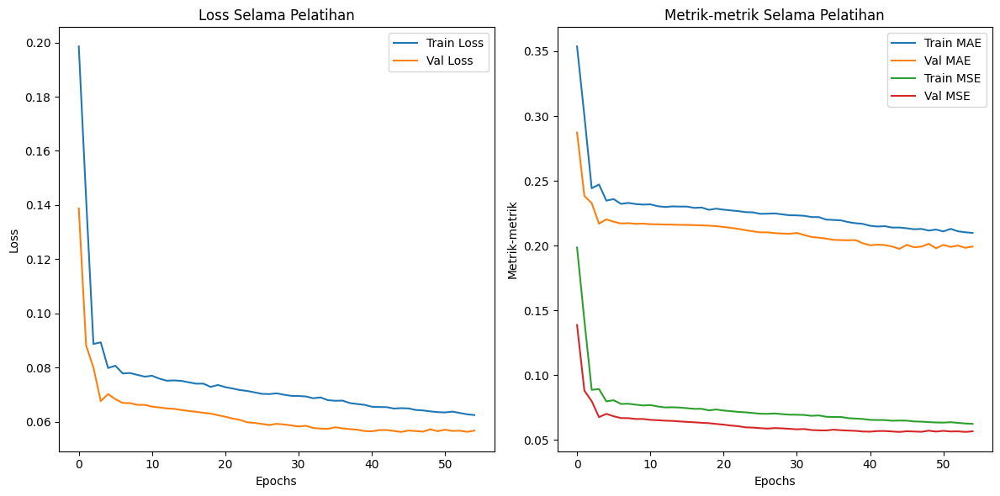

# BASD: Ball Screw Anomaly Detection  
A Final Project for Anomaly Detection using **ESP32 Devkit V4** with the **LSTM-Autoencoder method**. This project aims to identify **mechanical component degradation** (i.e., Ball Screw System) based on **accelerometer sensor data** to prevent performance decline.

## **Hardware Requirements**
The following hardware components are used:

- **ESP32 Devkit V4**  
- **Accelerometer Sensor** (MEMS)
- **RS485 Module MAX485**  

## **Prerequisites**

Ensure the following dependencies are installed to run the project:

| **Package**            | **Version**             | **Description**                           |
|------------------------|-------------------------|-------------------------------------------|
| `influxdb-client`       |                         | Client for interacting with InfluxDB      |
| `psycopg2-binary`      |                         | PostgreSQL adapter for Python            |
| `numpy`                | `<2`                    | Numerical computing library (below v2)    |
| `pandas`               |                         | Data manipulation and analysis library   |
| `protobuf`             | `==3.20.3`              | Protobuf for serializing structured data |
| `tensorflow-cpu`       | `==2.17.0`              | TensorFlow library (CPU version)         |
| `SQLAlchemy`           |                         | SQL toolkit and ORM for Python           |
| `python-dotenv`        |                         | Manage environment variables             |
| `APScheduler`          |                         | Advanced scheduling library for Python   |
| `Werkzeug`             | `==2.0.3`               | WSGI utility library for Flask           |
| `joblib`               |                         | Library for lightweight persistence      |
| `scikit-learn`         | `>=1.5.2`               | Machine learning library                 |
| `uvicorn`              | `>=0.32.0`              | ASGI server for FastAPI                  |
| `fastapi[standard]`    | `>=0.115.4`             | FastAPI web framework for building APIs  |
| `asyncio`              | `>=3.4.3`               | Library for asynchronous programming     |
| `msgpack`              | `>=1.1.0`               | Efficient binary serialization format    |
| `matplotlib`           | `>=3.9.3`               | Plotting library for visualizations      |

## **Data Collection and Processing**

### **Accelerometer Data Configuration**
The accelerometer sensor is used to measure **vibration patterns** of the Ball Screw System. The following configuration is used:

| **Parameter**      | **Value**          |
|---------------------|-------------------:|
| Sampling Rate       | 100 Hz            |
| Axes Used           | X, Y, Z           |

### **Preprocessing Steps**  
1. **Normalization**: Scale accelerometer values between $[0, 1]$. 
2. **Feature Engineering**: Introduce new feature derived from raw data, such as mean, stddev, kurtosis, and skewness.  
2. **Segmentation**: Data is segmented into windows of fixed size (e.g., 24 samples per window).  

## **Model Architecture: LSTM-Autoencoder**

The **LSTM-Autoencoder** is used to learn the normal vibration patterns of the Ball Screw System and detect anomalies based on reconstruction errors.

### **Architecture**:
- **Input**: Normalized Accelerometer Data (X, Y, Z Axes)  
- **Encoder**: LSTM Layers to compress input into latent features  
- **Decoder**: LSTM Layers to reconstruct input signals  
- **Loss Function**: Mean Squared Error (MSE)  

### **Training**  
The model is trained using only **normal data** for 100 epochs to identify the baseline behavior. Reconstruction error is then used to flag anomalies.

## **Results**

### **Training Accuracy**  
The model achieved stable reconstruction performance after 100 epochs:  

### **Anomaly Detection Results**  
The following **reconstruction error distribution** evaluates the model's ability to detect anomalies:  

## **Conclusion**
The **LSTM-Autoencoder** method successfully detects anomalies in the Ball Screw System using **accelerometer sensor data**. This approach can effectively identify mechanical degradation based on vibration patterns.  

## **Future Improvements**
- Add **multi-sensor fusion** (e.g., gyroscope, temperature sensors).  
- Deploy anomaly detection results to the **cloud** for remote monitoring.  

